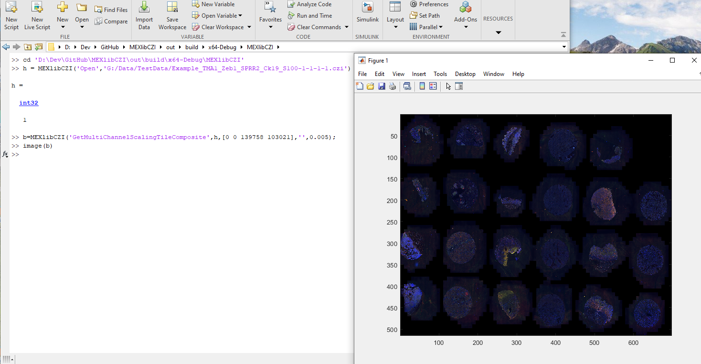

# MEXlibCZI

a [MEX-file](https://www.mathworks.com/help/matlab/call-mex-file-functions.html) for reading [CZI-documents](https://www.zeiss.com/microscopy/int/products/microscope-software/zen/czi.html)

# Description

This project provides a [MEX File Function](https://www.mathworks.com/help/matlab/call-mex-file-functions.html) which allows to
directly open and read a [CZI-documents](https://www.zeiss.com/microscopy/int/products/microscope-software/zen/czi.html).  
It is based on [libCZI](https://github.com/ptahmose/libCZI).

# Installing

Binaries for Windows-x64 and Linux-x64 are provided on the [release-page](https://github.com/ptahmose/MEXlibCZI/releases) here on GitHub.  
For building from sources run [cmake](https://cmake.org/).